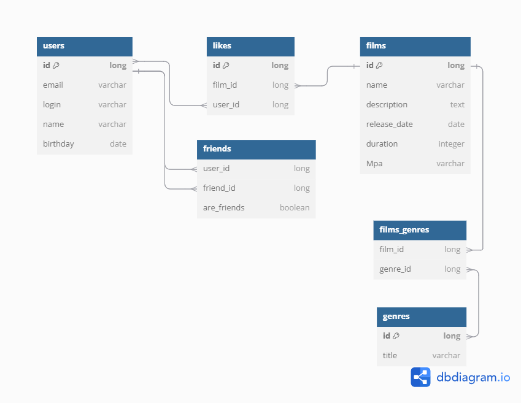

# java-filmorate

## Описание БД

---

### USERS
Пользователи 
<b>USER_ID</b> - ключевое поле, автоинкремент 
<b>EMAIL, LOGIN, USER_NAME, BIRTHDAY</b> - данные о пользователе

---

### USERS_FRIENDSHIP
Вспомогательная таблица для хранения данных о друзьях пользователей 
<b>(USER_FROM, USER_TO)</b> - составной ключ 
<b>USER_FROM</b> - от кого направлен запрос на дружбу 
<b>USER_TO</b> - кому направлен запрос на дружбу

---

### FILMS
Фильмы 
<b>FILM_ID</b> - ключевое поле, автоинкремент 
<b>FILM_NAME, DESCRIPTION, RELEASE_DATE, DURATION</b> - данные о фильме 
<b>MPA_ID</b> - ссылка на MPA фильма

---

### FILMS_GENRES
Вспомогательная таблица для взаимосвязи фильмов с их жанрами 
<b>(FILM_ID, GENRE_ID)</b> - составной ключ

---

### GENRES
Все возможные жанры фильмов 
<b>GENRE_ID</b> - ключевое поле, автоинкремент 
<b>GENRE_NAME</b> - название жанра

---

### MPA
Все возможные MPA фильмов 
<b>MPA_ID</b> - ключевое поле, автоинкремент 
<b>MPA_NAME</b> - буквенное обозначение MPA

---

### USERS_FILMS_LIKES
Вспомогательная таблица лайков фильмам от пользователей 
<b>LIKE_ID</b> - ключевое поле, автоинкремент 
<b>(USER_ID, FILM_ID)</b> - данные о лайке

---

### DIRECTORS
Режиссеры 
<b>DIRECTOR_ID</b> - ключевое поле, автоинкремент 
<b>DIRECTOR_NAME</b> - имя режиссера

---

### FILMS_DIRECTORS
Вспомогательная таблица для взаимосвязи фильмов с их режиссерами 
<b>(FILM_ID, DIRECTOR_ID)</b> - составной ключ

---

### REVIEWS
Отзывы на фильмы 
<b>REVIEW_ID</b> - ключевое поле, автоинкремент 
<b>CONTENT, IS_POSITIVE</b> - данные об отзыве 
<b>USER_ID</b> - ссылка на пользователя, который оставил отзыв
<b>FILM_ID</b> - ссылка на фильм, которому оставили отзыв

---

### REVIEW_LIKES
Вспомогательная таблица для взаимосвязи отзывов и лайков отзывам 
<b>(REVIEW_ID, USER_ID)</b> - составной ключ
<b>IS_POSITIVE</b> - оценка отзыва (положительный\отрицательный)

---

### USERS_EVENTS
События для ленты пользователя 
<b>EVENT_ID</b> - ключевое поле, автоинкремент 
<b>EVENT_TYPE_ID, EVENT_OPERATION_ID, EVENT_TIMESTAMP</b> - данные о событии 
<b>USER_ID</b> - ссылка на пользователя, который оставил совершил действие
<b>ENTITY_ID</b> - ссылка на сущность, с которой пользователь совершил действие

---

### EVENTS_TYPES
Все возможные типы событий для ленты пользователя - LIKE, REVIEW, FRIEND 
<b>EVENT_TYPE_ID</b> - ключевое поле, автоинкремент 
<b>EVENT_TYPE_NAME</b> - обозначение типа события

---

### EVENTS_OPERATIONS
Все возможные типы операций для ленты пользователя - REMOVE, ADD, UPDATE 
<b>EVENT_OPERATION_ID</b> - ключевое поле, автоинкремент 
<b>EVENT_OPERATION_NAME</b> - обозначение типа операции